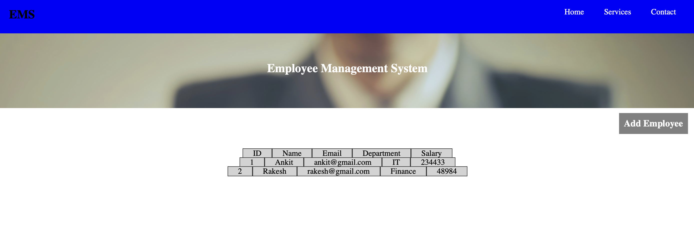
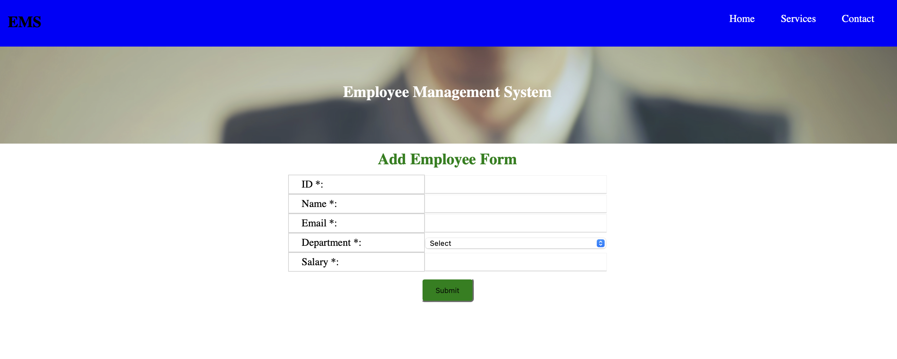

<u>TITLE </u> : Create and List Employees

<u>DESCRIPTION </u> : This Project displays the list of Employees. It allows to create an Employee.

<u>Screenshots</u> :

  List Employee::

  Create Employee::

  

<u>Technologies</u>: NodeJS, ReactJS

<u>Running the Project</u>:
Clone the Project from ![Github] (https://github.com/ankitfs/crud-ui-frontend)

Run Command <strong>npm install</strong> for downloading the required dependencies.

Run Command <strong>npm start</strong> for running the project in Browser.

